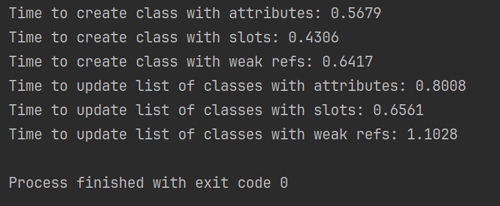

### Описание задачи

Было создано три класса:

1. класс с обычными атрибутами;
2. класс со слотами;
3. класс с атрибутами weakref.

Затем создавались экземпляры данных классов в количестве 1 млн. штук и сохранялись в список. Затем, для каждого
элемента данного списка обновлялись его атрибуты.

Результаты замера времени на каждый исследованный случай приведены на скриншоте ниже:

### Вывод

Список классов, атрибуты которых являются слотами, требует минимального времени на создание и обновление по сравнению с
остальными случаями.

Список классов со слабыми ссылками (weak references) в качестве атрибутов, создаётся и обновляется за максимальное
время по сравнению с другими вариантами.

Время, необходимое на создание и обновление списка классов с обычными атрибутами является средним значением по сравнению
с классами со слотами и слабыми ссылками.